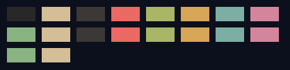

<div align="center">
<h1>richcolors</h1>

> A Python-based command-line application that generates a picture containing
> color swatches of all the hex-codes in a given input file.


<h3 >Sample Output: <h3>



</div>

## Usage:
It is as simple as writing `richcolors <hex-codes-filename> <output-pic-filename>`

## Supported filetypes:
As far as I have tested it, it can support

* For input files:`.txt` `.md` `.ini` and `.toml`.
* For output files: Everything given in [Pillow's documentation](https://pillow-wiredfool.readthedocs.io/en/latest/handbook/image-file-formats.html)

## Installation:
```
git clone https://github.com/Rizen54/richcolors
cd richcolors/
python3 -m pip install -r requirements.txt
chmod +x richcolors
sudo cp richcolors /usr/local/bin/richcolors
alias richcolors='python3 /usr/local/bin/richcolors'
```

Lastly, add this line to the end of your `.bashrc` or `.zshrc`:

```bash
alias richcolors='python3 /usr/local/bin/richcolors'
```

## Socials
You can checkout my socials at my profile repo.
💬 My Discord server if you're interested in my projs: [Rizen's Server](https://discord.gg/BSCkxtxNJ6)

## Stars
Please support me by giving a star to this repo.
> Small click for a person, giant star for another.
